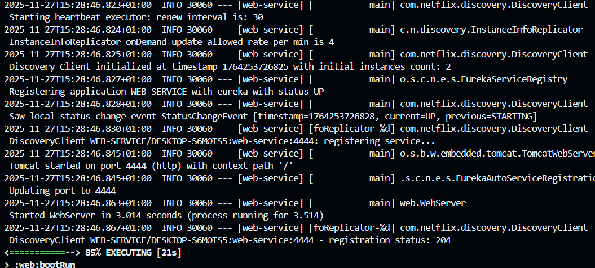
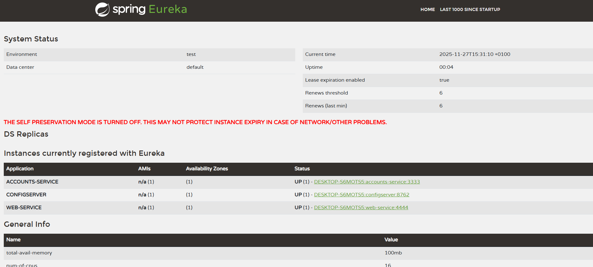
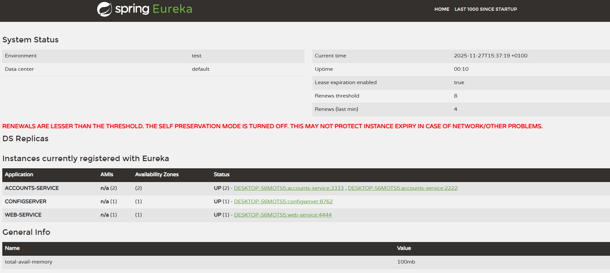
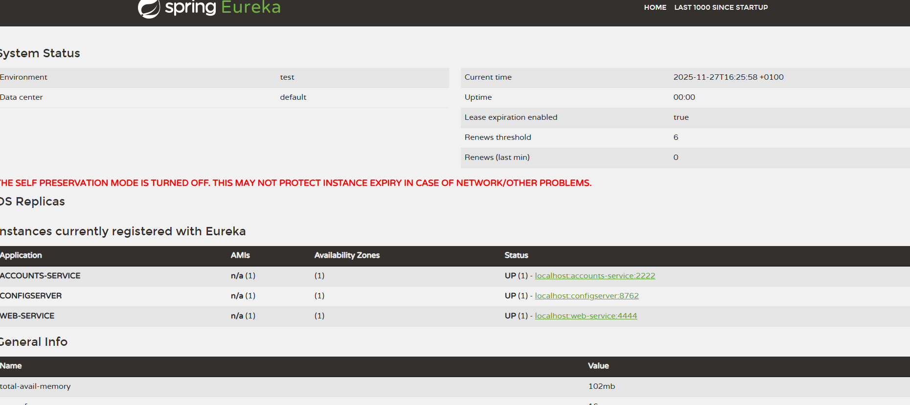
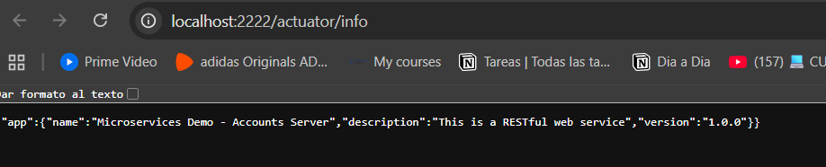

---

# Lab 6 Microservices - Project Report

## 1. Configuration Setup

**Configuration Repository**: `https://github.com/PabloVilla199/lab6-microservices`

**Changes made:**

* Modifiqué el archivo `accounts-service.yml` para cambiar el puerto de `3333` a `2222`.
* Esta configuración externa permite que los servicios obtengan parámetros sin necesidad de recompilar, facilitando la escalabilidad y la resiliencia de los microservicios.

**Why externalized configuration is useful:**

* Permite actualizar la configuración de servicios en ejecución sin reiniciar la aplicación.
* Mejora la consistencia de parámetros en entornos distribuidos.
* Facilita el versionado y control centralizado de configuraciones para múltiples servicios.

---

## 2. Service Registration (Task 1)

### Accounts Service Registration

Cuando el Accounts Service se inicia, se registra automáticamente en Eureka mediante la información de (`ACCOUNTS-SERVICE`) y su puerto configurado. Eureka recibe el registro, almacena los metadatos y confirma con un estado `UP` que el servicio está disponible.

### Web Service Registration

El Web Service también se registra en Eureka como `WEB-SERVICE`.

---

## 3. Eureka Dashboard (Task 2)

* Muestra todos los servicios registrados en Eureka (`ACCOUNTS-SERVICE`, `WEB-SERVICE`, `CONFIGSERVER`).
* Para cada instancia, se muestra: nombre de aplicación, puerto, estado (`UP`), dirección IP y tiempo de vida.
* Permite monitorear la disponibilidad de cada servicio y el número de instancias activas.

---

## 4. Multiple Instances (Task 4)

* Al iniciar una segunda instancia del Accounts Service (puerto 2222), Eureka registra ambas instancias.
* Eureka maneja múltiples instancias manteniendo información de cada una, el cliente puede usar cualquier instancia disponible para balancear la carga.
* El client-side load balancing distribuye las peticiones entre instancias disponibles mediante round-robin o estrategias configurables, evitando sobrecargar una sola instancia.

---

## 5. Service Failure Analysis (Task 5)

### Initial Failure

Inmediatamente después de detener la instancia de Accounts Service en el puerto 3333, las peticiones del Web Service fallan temporalmente con errores de conexión. Esto ocurre porque Eureka aún no ha detectado que la instancia está caída.

### Eureka Instance Removal

* Eureka detecta fallos mediante heartbeats periódicos de cada instancia.
* Tras la expiración del, Eureka elimina la instancia muerta de su registro.
* Después de esto, todas las peticiones del Web Service son redirigidas a la instancia activa restante (puerto 2222).

---

## 6. Service Recovery Analysis (Task 6)

* El Web Service se recupera porque Eureka ya no incluye la instancia caída en el registro y solo consulta la instancia activa restante.
* La recuperación toma alrededor de 30-60 segundos, dependiendo del tiempo de expiración configurado.
* El cache del cliente de Eureka permite que las llamadas se mantengan estables durante la transición, evitando interrupciones mayores.

---

## 7. Conclusions

* He comprendido la arquitectura de microservicios y la importancia de separar responsabilidades en servicios independientes.
* He aprendido a usar Eureka para el descubrimiento dinámico de servicios y la gestión de múltiples instancias.
* He observado cómo el sistema maneja fallos, mostrando resiliencia y autocuración.
* He encontrado desafíos en sincronizar los tiempos de registro y la expiración de instancias, solucionados al esperar los heartbeats y monitorear logs y dashboard.

---

## 8. AI Disclosure

**AI Tools Used:** ChatGPT

* Me ayudó a estructurar el informe y explicar los conceptos de microservicios y Eureka de manera clara.
* Todo el trabajo práctico, se hicieron de forma manual.

---
